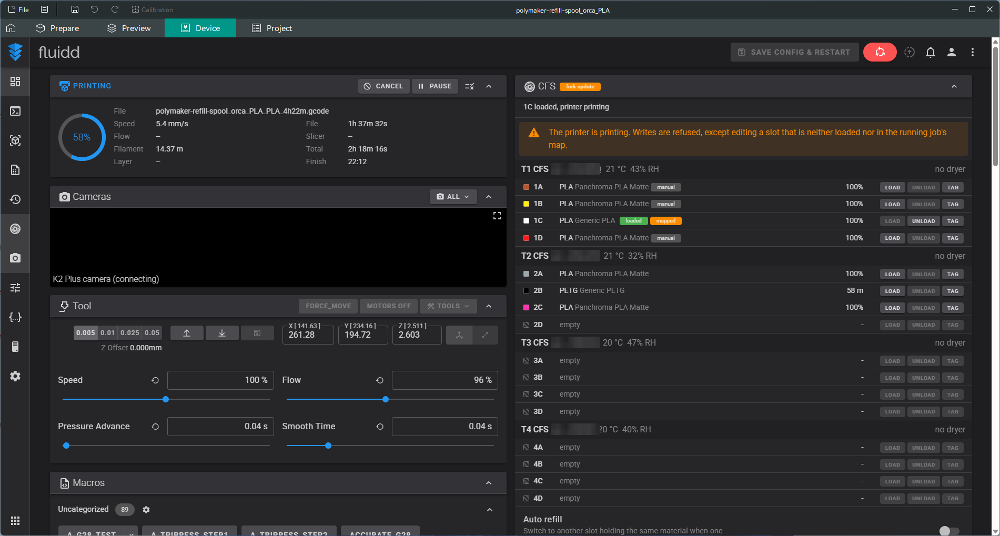
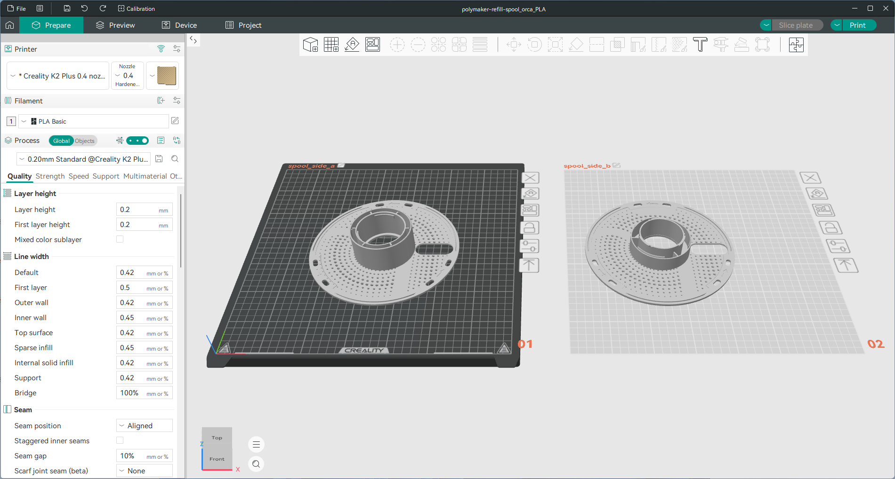
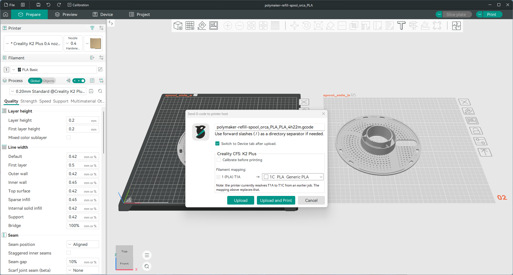
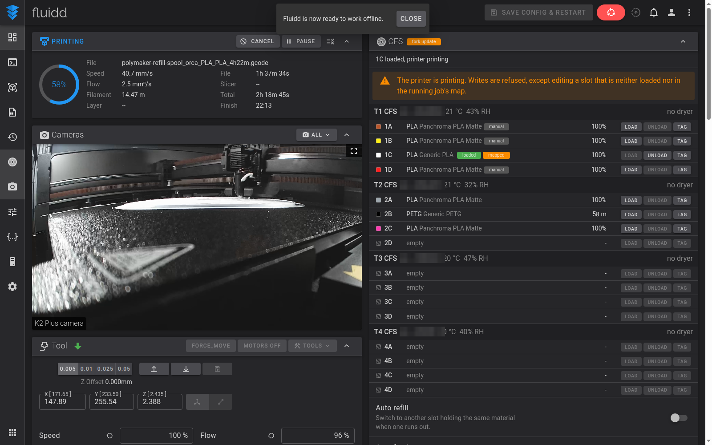
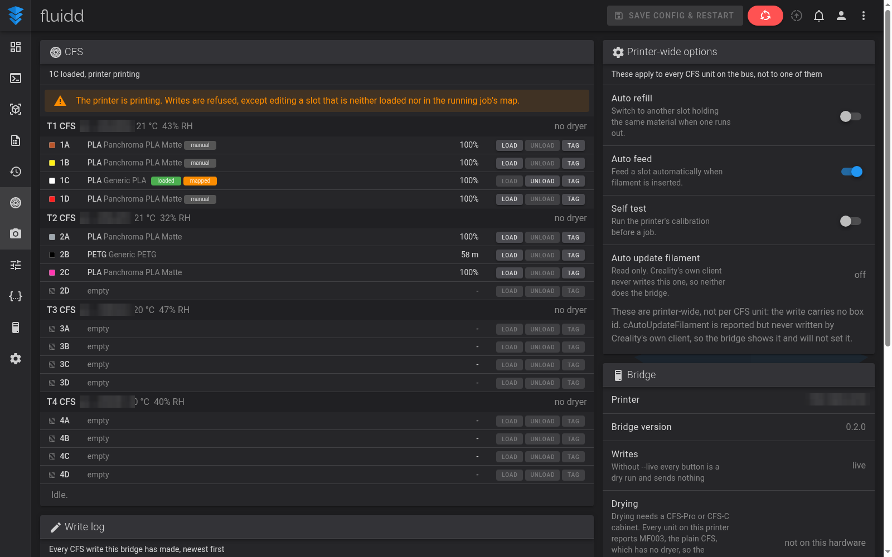
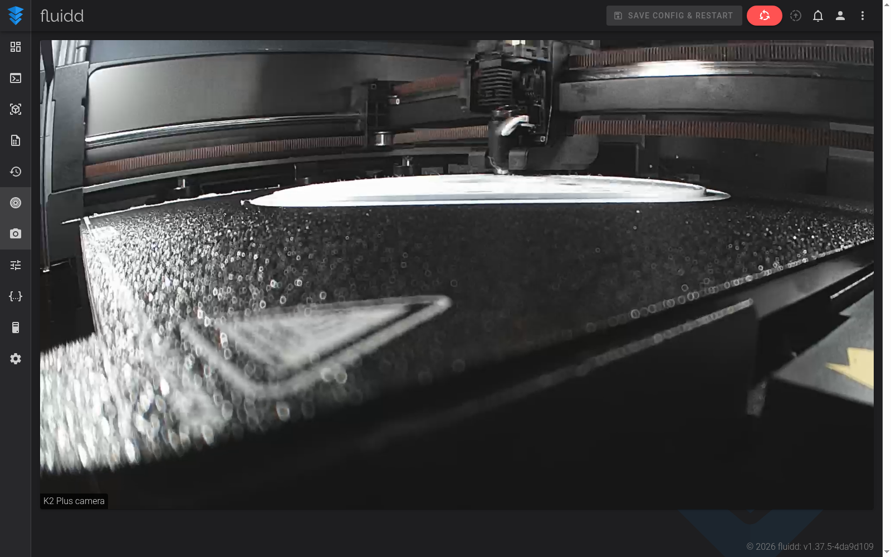

# Creality CFS Bridge, part of Unofficial Creality OrcaSlicer with CFS, Camera Support

This repository is the bridge half of the project: a small local service that talks to a Creality
K2 family printer, serves Fluidd with a CFS card, and negotiates the printer's camera. The other
half is the slicer fork, [jscottdouglas/OrcaSlicer](https://github.com/jscottdouglas/OrcaSlicer),
an OrcaSlicer build that can slice for a K2 family printer, map each extruder to a real CFS slot
when it sends the job, and show the printer's camera and CFS units in its Device tab. Together
they are a small Windows service plus a build of OrcaSlicer that knows how to talk to it.

> **Unofficial. Not affiliated with, endorsed by or supported by Creality or the OrcaSlicer
> project.** Nothing here is a Creality product. Use it at your own risk, on your own printer.

## Requirements

- A **Creality K2 Plus**, or another K2 family printer with CFS units, reachable on the same LAN
  as the PC, on stock Creality firmware.
- **Windows 10 or 11, 64-bit** for the installer. The bridge itself also runs from source on
  Linux with Python 3.12.
- The **slicer fork**, [jscottdouglas/OrcaSlicer](https://github.com/jscottdouglas/OrcaSlicer),
  for slot mapping on send. The bridge runs without it, but the mapping happens in the slicer.

## Supported printers

Creality K2 family with CFS, on stock Creality firmware. LAN mode is not required, and no
firmware change, root access or hardware modification is involved.

## Status

Honest about what has and has not been run against a printer:

- Developed and used **on a K2 Plus with four CFS units**.
- **The slicer's send-with-mapping has printed real jobs.** Picking a slot per extruder in the
  send dialog and pressing Print is the path that gets the most use.
- **The bridge's CFS card reads are live**: units, slots, material, colour, remaining length,
  temperature and humidity all come from the printer.
- **Not yet exercised on a printer:** the bridge's own job start, and the CFS card's **Load**,
  **Unload** and **Tag** actions. The frames are built and checked against the protocol, but
  they have not been sent to real hardware. The UI marks them as such, and the bridge refuses
  all of them while a print is running.

## What it does

- **Slot mapping on send.** The send dialog shows the CFS slots the printer actually reports and
  lets you map each extruder to one. The mapping is verified against the printer before the job
  starts, so a job never begins against a slot that has moved.
- **The camera in the Device tab.** The K2's camera is WebRTC-only behind a Creality-specific
  signalling envelope, which no standard player speaks. The bridge negotiates it and serves the
  picture where the slicer can show it.
- **A CFS card in Fluidd.** Each unit with its temperature, humidity, four slots, material,
  colour and remaining length, plus the printer-wide CFS options and a log of every write.

## Install

1. Download the bridge setup from the [Releases](../../releases) page.
2. Run it. It installs the `CrealityCFSBridge` service (automatic start, listening on
   127.0.0.1:7126 only) and, unless you untick it, the matching unofficial OrcaSlicer build.
3. The setup opens a page and asks for your printer's address. Enter it and press **Test**.

That is the whole install. The address is saved in
`%ProgramData%\CrealityCFSBridge\config.json` and you can change it later from the same page.

If you would rather install the slicer yourself, untick it in the setup and take the installer
from the slicer fork's own releases; the bridge does not care how the slicer got there.

## Printer setup, step by step

### 1. On the printer

Connect the K2 Plus to the same network as the PC and note its address (**Settings**, then
**Network**, on the touchscreen). Have the CFS units plugged in and showing their numbers on
their own displays. Stock Creality firmware is what this expects, and LAN mode is not needed.

### 2. In the bridge setup page

Enter the address and press **Test**. The page reports the printer model, its firmware and the
CFS units it found. If it finds nothing, see the checks at the bottom of this page.

### 3. In the slicer

The **Creality K2 Plus (CFS)** printer preset is already selected. The **Device** tab shows
Fluidd with the CFS card and the camera.

The screenshots below were taken on an earlier build, so the version number on the Bridge card
differs from the one in the current release.

*The Device tab: Fluidd with the CFS card. The camera pane is still connecting in this shot; the
camera playing is in the dashboard screenshot below.*

*The Prepare view. Pick the filament per extruder exactly as you normally would.*

### 4. Slicing and sending

Pick the filament per extruder as usual and press **Print plate**. The send dialog lists the
printer's CFS slots and lets you map each extruder to a slot. The mapping is checked against the
printer before the job starts.

*The send dialog: every slot the printer reports, and the extruder mapped to each one.*

*The Fluidd dashboard, with the camera playing and the CFS card alongside the standard cards.
Both can be moved or hidden like any other card.*

*The CFS page: every unit, every slot, the printer-wide options and the write log.*

*The Camera page, full width.*

### 5. Checks and known limits

- **The printer is not found.** Check the address is the one the touchscreen shows, check the PC
  and the printer are on the same subnet, and let the bridge through the Windows firewall. The
  bridge listens on loopback only, so it is outbound traffic to the printer that matters.
- **The camera takes a few seconds.** The WebRTC handshake with the printer has to complete
  before the first frame arrives; a few seconds on connect is normal, and it reconnects on its
  own if the picture drops.
- **A print already running blocks CFS writes.** While a job is on the bed the bridge refuses
  the writes that could disturb it, and says so rather than failing silently.

## What it does not do

- **No CFS writes are sent from the slicer.** The slicer reads slots and maps a job to them.
  Nothing in the slicer path edits a spool label, loads or unloads filament.
- The writes the bridge itself can perform are documented with the gate on each one in
  [docs/PROTOCOL.md](docs/PROTOCOL.md), and every one of them is refused mid-print.
- It does not manage drying, does not touch the printer's firmware, and does not send anything
  to any server other than your printer (plus an anonymous GitHub query, twice a day, to tell
  you when an upstream release exists).

## Documentation

- [docs/PROTOCOL.md](docs/PROTOCOL.md) - the K2 LAN protocol, port by port and frame by frame.
- [docs/CAMERA.md](docs/CAMERA.md) - how the camera stream is actually negotiated.
- [docs/FLUIDD_FORK.md](docs/FLUIDD_FORK.md) - what the Fluidd fork changes, and how to rebase it.
- [docs/ORCA_PRESET.md](docs/ORCA_PRESET.md) - the one preset file that routes the Print button.
- [docs/RELEASING.md](docs/RELEASING.md) - how a release is cut and what has to be pinned first.

The test suite is kept in the author's private tree and is not part of this repository.

## Licences

Copyright (C) 2026 jscottdouglas.

This program is free software: you can redistribute it and/or modify it under the terms of the
GNU General Public License, version 3, as published by the Free Software Foundation. It is
distributed in the hope that it will be useful, but WITHOUT ANY WARRANTY, without even the
implied warranty of MERCHANTABILITY or FITNESS FOR A PARTICULAR PURPOSE. See the GNU General
Public License for more details.

- **This bridge:** GPL-3.0-only. See [LICENSE](LICENSE).
- **The Fluidd fork** (`jscottdouglas/fluidd`): GPL-3.0, following upstream Fluidd.
- **The slicer fork** (`jscottdouglas/OrcaSlicer`): AGPL-3.0, following upstream OrcaSlicer.

## Credits

- [SoftFever/OrcaSlicer](https://github.com/SoftFever/OrcaSlicer), the slicer this build forks.
- [fluidd-core/fluidd](https://github.com/fluidd-core/fluidd), the web interface the CFS card is
  built into.

## Getting help

Problems and questions go on this repository's
[Issues](https://github.com/jscottdouglas/creality-cfs-bridge/issues) page. A report is much
easier to act on when it includes:

- the **bridge version** (`cfsbridge.exe --version`, also shown on the Bridge card in Fluidd),
- the **printer model** and how many CFS units are attached,
- the relevant part of **`serve.log`**, from
  `%ProgramData%\CrealityCFSBridge\logs`, with any serial numbers removed before you paste it.

Creality is a trademark of its owner. This project is not affiliated with, endorsed by or
supported by Creality, the OrcaSlicer project or the Fluidd project.
